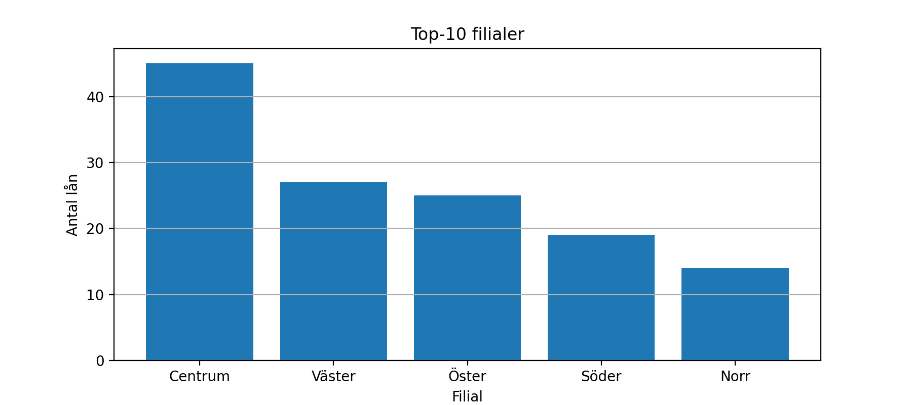

# EDA - Biblioteksutlåning

## Raport
### Nyckeltal (från notebooken, efter lätt städning)
- **Totalt antal lån:** 116
- **Genomsnittlig lånetid:** 21.3 dagar
- **Antal lån på övertid:** 47.6 %

### Figurer



 

### Tabeller (exporterade)
- `../data/pivot_branch_x_genre.csv`

### Slutsatser baserad på aktuell data 
- **Topp- genrer:** 1. Biografi (22), 2. Fakta (22), 3. Deckare (20).
- **Topp-filialer:** 1. Öster (32), 2. Väster (28), 3. Norr (21).
- **Säsongstopp:** 2025-01 med **16** unika lån/mån
- **Policy-notering:** Övertidsandelen ligger på **47,6 %** - följ upp med påminnelser.


## Miljö
- **Python:** 3.13.7
- **Paket:** `Pandas`, `matplotlib`(se `requirements.txt`)

## Kom igång

```bash
# klona projektet
git clone https://github.com/KataBeh/EDA--Biblioteket.git

cd library-eda

# Skapa och aktivera virtuell miljö
python -m venv . venv
# Windows PowerShell
.venv\Scripts\Activate

# macOs\ Linux
# source .venv/bin/activate

# instalera beroenden
python -m pip install -r requirements.txt
```
